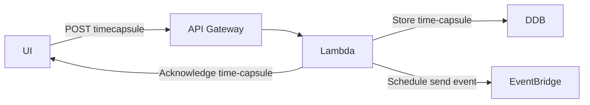
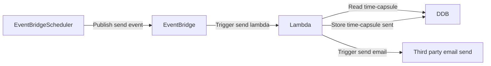

Basic idea:
Time Capsule Messages: An app where users write messages to themselves or others, scheduled to be delivered at a future date, fostering reflection or anticipation.

Core workflow:
- The user goes to the website.
- The user enters a message, an email address, a date and time for the message to be delivered, a name for who is sending the message.
- The users clicks a button to submit their message, and they receive an acknowledgement that their request has been processed.
- At the specified date and time, an email is sent to the specified address with the message.

# Architectural considerations

The application's backend must be deployed on AWS using serverless technologies (notably lambda, api gateway, event-bridge, sqs, dynamodb, step-functions).
The application must follow an event-driven architecture.

# Technological stack

The application's backend must be written in typescript with node.js.
The application's frontend must be written in typescript using the react framework and deployed as an SPA on S3 + cloudfront.

# Architecture diagram

## At schedule time

## At send time

